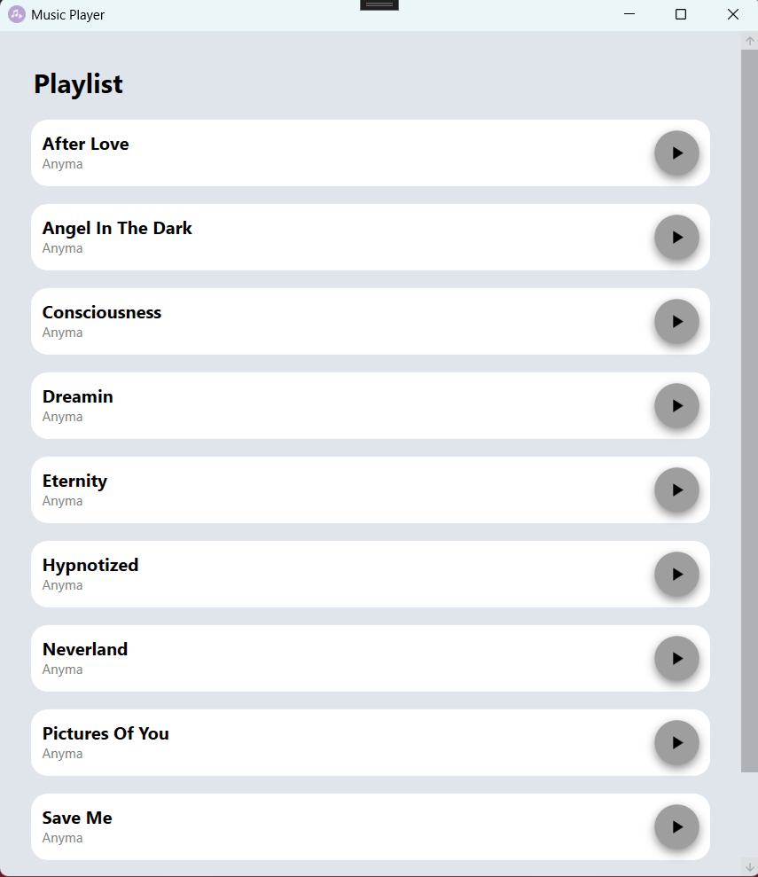
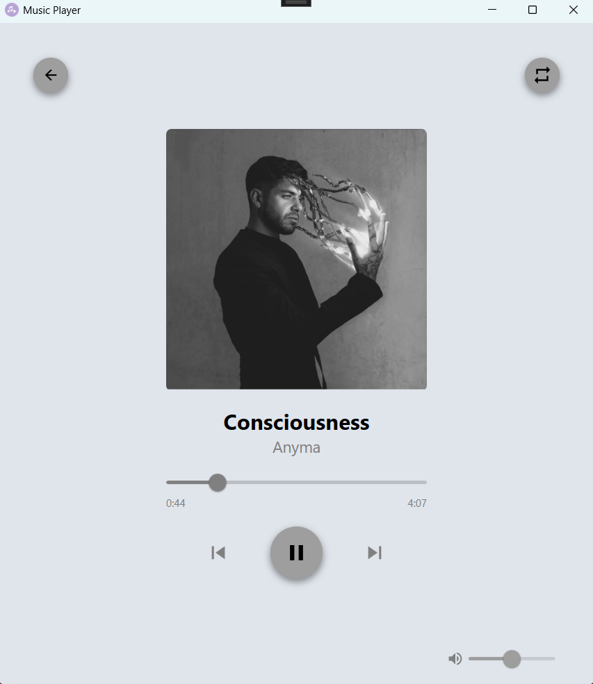

# Music player
## Description
The user can select the desired song by clicking the "Play" button, which opens the screen displaying the currently playing track. On this screen, the user can pause the song, enable the repeat option, skip to the previous or next song, adjust the volume and return to the song list at any time.

## Screenshots

